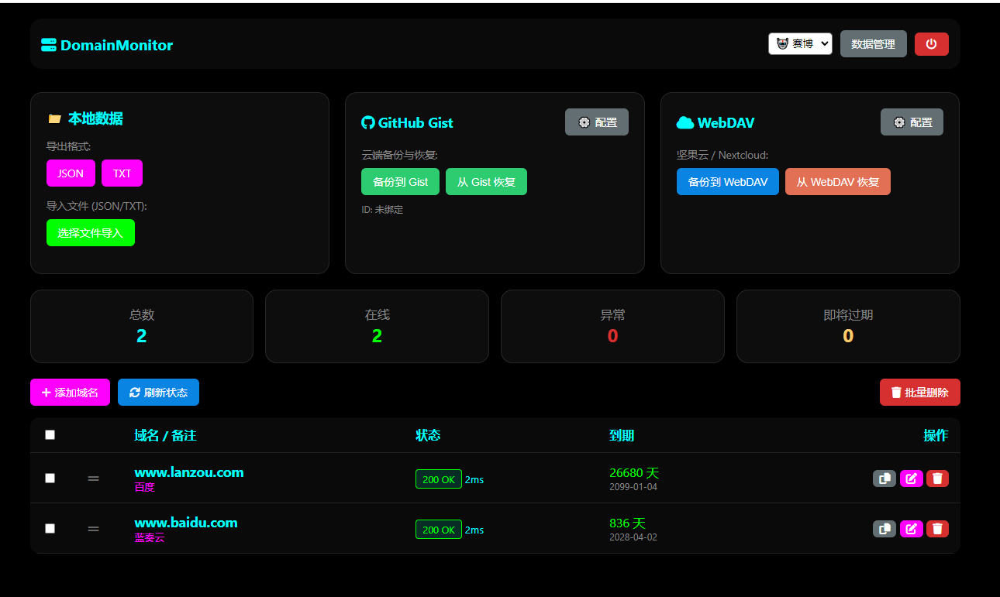

# 🌐 Domain Monitor Pro (轻量级域名监控面板)

基于 Flask 开发的单文件域名监控工具。支持批量管理、状态检测、到期时间记录，并内置多种主题与云端备份功能。

##✨ 核心功能

### 🖥️ 现代化用户界面交互
- **多主题切换**：内置 `深色(默认)`、`浅色`、`赛博朋克` 三种主题，一键切换。
- **拖拽排序**：支持鼠标直接拖拽列表调整域名顺序。
- **响应式设计**：完美适配 PC 端与移动端显示。
- **一键复制**：兼容性优化的剪贴板复制功能。

### ⚡ 高效监控
- **实时状态检测**：异步刷新，显示具体的 HTTP 状态码（200, 403, 404 等）及响应延迟（ms）。
- **到期提醒**：直观显示剩余天数，少于 30 天自动高亮预警。
- **详细信息**：记录注册日期、到期日期及备注信息。

###🛠️ 数据管理大师
- **批量操作**：支持批量添加（一行一个）、批量刷新、批量删除。
- **云端备份**：
  - **GitHub Gist**：一键同步数据到 Gist，支持版本控制。
  - **WebDAV**：支持坚果云、Nextcloud 等 WebDAV 协议备份与恢复。 
- **本地导入/导出**：支持 JSON、TXT 格式的导入与导出。

### 🔒 安全性
- **访问控制**：内置登录验证系统。
- **隐私保护**：配置信息（Token/密码）加密存储在本地数据库。

## 🚀 快速开始

### 1. 安装依赖
确保你的环境已安装 Python 3.x，然后运行：
```bash
pip install -r requirements.txt

### 2. 运行项目
```<BASH>
python flask_app.py

### 3. 访问
打开浏览器访问 http://localhost:5000

默认密码：1234560 (请在代码配置中修改)

⚙️ 环境变量 (可选)
建议在生产环境中使用环境变量配置密钥：

SECRET_KEY: Flask Session 密钥
ADMIN_PASSWORD: 登录密码
📂 文件结构
此项目采用单文件架构，部署极其简单：

flask_app.py: 主程序
domains_v4.db: 数据库文件 (自动生成)
templates/: 内置于代码中，无需额外文件
📝 待办事项
 增加 Telegram/微信 掉线通知
 增加 SSL 证书过期检测
 增加 Whois 自动查询



Made with ❤️ by [ccluyan]


